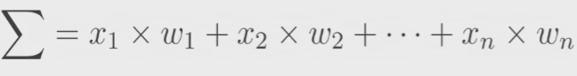
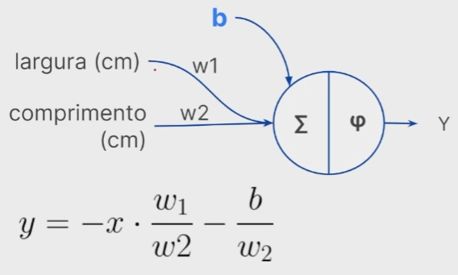
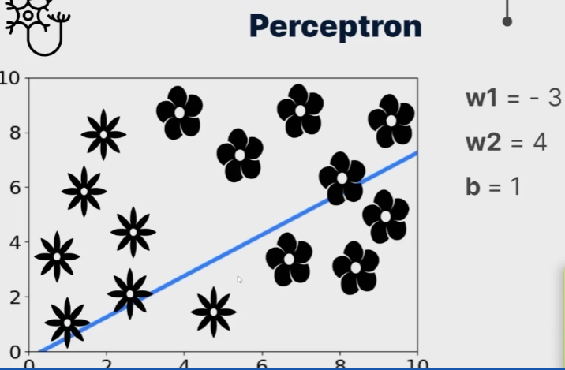
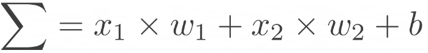
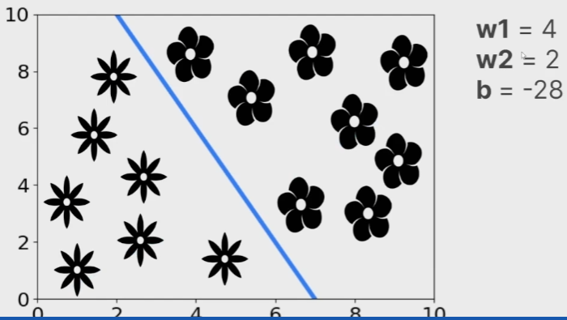

## Curiosidades e explicação sobre Redes Neurais:

#### **Perceptron (Neurônio Artificial) 1957**

O **Percentron** foi a arquitetura computacional **melhorada** que imitou o neurônio biológico e conseguia aprender.

Frank Rosenblatt (psicólogo) é considerado o pai da **Deep Learning**.

#### **O que é o Percentron?**

O perceptron é a **unidade básica da construção de uma rede neural**. Todos os estudos que envolveram redes neurais ao longo dos anos tiveram como origem esse desenvolvimento do perceptron.

O *Perceptron* é uma arquitetura dividida em **5 partes**:
- Entradas.
- Pesos.
- Função Soma.
- Função de Ativação.
- Saída.

**O que faz?**
- É um modelo neural que **associa pesos** às entradas do modelo.
- A quantidade de pesos é correspondente a quantidade de entradas (para cada entrada, terá um peso).
- Temos também o **b** (bias ou viés) que também é um tipo de peso. Irá adicionar um novo víes ao cálculo do aprendizado do modelo.
    - O viés é muito importante para permitir que o modelo converja na direção ao menor número de perda.

**Soma:**
- Na seção *Soma*, é realizado a **soma ponderada**.
    - A soma ponderada é uma técnica estatística que calcula um valor total considerando a importância relativa de cada um elemento na soma. Essa importância relativa seria os **pesos**.

**Ativação:**
- A função de ativação irá **receber os dados da soma e gerar uma saída**.
- Existem várias funções de ativação para problemas lineares e não lineares. Algumas delas são:
    - *linear* - Problemas lineares.
    - *relu* - Problemas não lineares.

**Direção:**

O sentido de propagação da informação de um *Perceptron* é sempre das **entradas para a saída** (assim como, de um neurônio biológico).

#### **Como ocorre o aprendizado?**

Todo o aprendizado ocorre nas camadas de soma e ativação.

A função Soma no *Perceptron* tem muita ligação com a formação da reta de separação, ela segue um modelo matemático linear que se expressa da seguinte forma:

O nome dessa técnica se chama *soma ponderada* (explicada anteriormente). Porém, como temos o valor de bias (viés), também adicionamos o valor de viés nessa equação.

O resultado da função soma é passado para a **função de ativação** que irá retornar um resultado correspondente a função realizada (este resultado depende muito do tipo de função de ativação utilizada).

Após a saída, é verificado se os valores dos pessos correspondem ou não corretamente com a reta de separação (em problemas lineares, por exemplo).

**Como é feito essa verificação?**

Os valores de peso, no caso, *w1* e *w2* e *b* (bies/viés) são alterados constantemente durante o aprendizado.

Digamos que iniciamos os valores de pesos e viéses de forma aleatória e a reta será centrada na origem:

Porém, com estes valores a nossa reta de separação ainda não é precisa e não é possível separar os dois tipos de flores que temos no exemplo.

O modelo de perceptron irá "entender" esta situação e irá **atualizar os pesos** até que o resultado seja satisfatório que separe corretamente o problema, onde os valores de pesos e viéses estarão ajustados.

Basicamente, a alteração dos valores de *w1* e *w2* irão apenas rotacionar a reta. Porém, para tirar a reta da origem, precisamos **adicionar um víés (ou bias)**, ao final da equação *soma* como uma constante:

Como resultado, ao otimizar os valores de pesos e bias (viés), teremos uma reta capaz de dividir o plano de dados por suas classes.

## Redes Neurais Convolucionais

As **redes neurais convolucionais** não irá usar todas as entradas da imagem (no caso, os pixels). Ao invés disso, a partir de um processo chamado de *convolução* será extraído as características mais importantes das imagens (como bordas, texturas, formas, etc).

Basicamente, temos 4 etapas antes de criar uma rede neural densa (que seria a camada de saída da rede neural, para classificar a imagem):

- Operador de convolução
- Pooling
- Flattening
- Rede neural densa

**Operador de convoluçao:**

- Convolução é o processo de adicionar cada elemento da imagem para seus vizinhos, ponderado por um kernel.
- A imagem é uma matriz e o kernel é outra matriz.
- A imagem será multiplicada pelo kernel (multiplicação de matrizes), onde é multiplicado cada pixel pela entrada correspondente do kernel e me seguida, é realizado a soma.

De forma geral, o processo de convolução realiza cálculos matemáticos, como multiplicação e soma de matrizes.