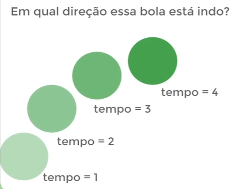
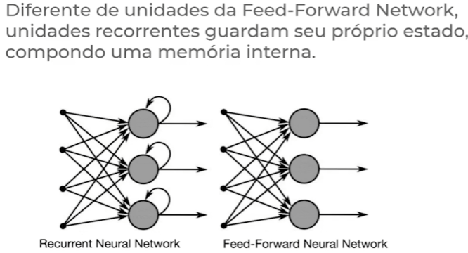

# Redes Recorrentes (LSTM, GRU)

### Sequências

Exemplo didático:

Em um problema onde precisamos saber para onde uma bola está indo (sua direção), apenas com um frame (uma foto) de um único instante da bola não é possível responder essa pergunta. Portanto para isto, é necessário saber quais direções a bola tomou anteriormente e com isso prever a direção da bola no próximo frame.

Caso for necessário responder perguntas desse tipo onde é necessário ter informações anteriores (histórico) para prever informações futuras, as redes recorrentes podem solucionar este problema.

O conceito de **memória sequencial** é um mecanismo que torna mais fácil para o cérebro reconhecer padrões de sequência.

Eventos únicos (atômicos) que tem uma relação entre si e a ordem deles é um fator relevante. O papel da rede neural recorrente é justamente mapear/entender/processar qual é a relação entre esses eventos para ser capaz de classificar esses eventos, como por exemplo, classificar se uma música é Jazz, Rock, Clássica, gerar novos eventos, como gerar novos paragrafos para um texto, ou prever o clima (temperatura).

#### Problemas que poderiam ser abordados por redes neurais recorrentes

**Processamento de texto**

As redes neurais recorrentes são muito populares para processamento de texto.

**Elemento Atômico (ou unidade atômica)**: São por exemplo, palavras. Cada palavra de um texto é um elemento da sequência que acontece em um instante de tempo.

Exemplo:
(Ada) (Lovelace) (foi) (uma) (matemática) (...)

Ou pode-se dizer também que o elemento atômico são as letras:
(A) (d) (a) (L) (o) (v) (e) (l) (a) (c) (e)

**Música e processamento de aúdio**

Assim como as palavras, a música e o processamento de um aúdio também envolve sequências.

**Previsão de clima**

Os sistemas de previsão de temperatura também utilizam como base redes neurais recorrentes, pois precisam recorrer a climas de dias anteriores para prever o clima do dia seguinte.

**Finanças**

Pelo fato de aplicações financeiras serem dados sequenciais, também é possível utilizar redes neurais recorrentes para abordar problemas desse tipo, como por exemplo, prever o valor futuro de uma ação na bolsa de valores. Isto poderia ser feito, por exemplo, pegando os valores de uma ação de dias anteriores (em determinados instantes de tempo) para prever o valor de alguns dias no futuro. 

Em outras palavras, saber o valor de uma ação no passado é muito relevante para inferir o seu valor no futuro.

A ordem relevante nesse caso é o próprio tempo. Podemos coletar um valor por semana, por dia, ou até mais de um valor por dia, a depender da granularidade de inferência desejada.

Granularidade -> Nível de detalhe.

### Por que usar redes recorrentes? 

As redes neurais artificiais (tradicionais) apresentam limitações para lidar com sequências, em grande parte, essas limitações estão associadas com a **incapacidade de guardar memória** das instâncias anteriores.

Além de retornar uma saída, devolve a saída como entrada da próxima etapa. Ou seja, tem uma arquitetura onde permite que a saída de uma camada seja retroalimentada como entrada para a próxima camada, criando uma conexão cíclica (loop) apresentado na imagem acima. Isso permite que a rede mantenha informações sobre entradas passadas e use esse contexto para prever ou classificar dados futuros.